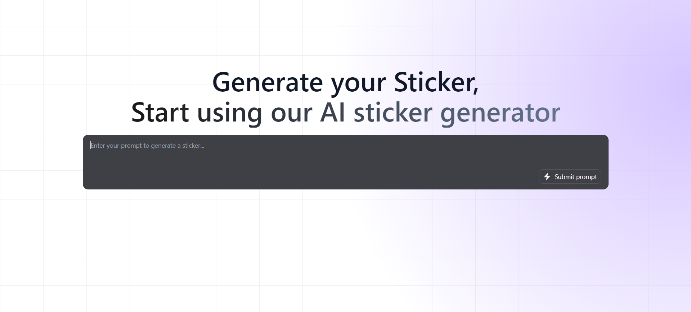

# PictoStick (Vue 3 + Vite)

PictoStick is a sticker generator using ai by your prompt



### 1. Install NPM Dependencies
Run the following command to install all the necessary Node.js dependencies.

```bash
npm install
```

### 2. Build the Frontend
Compile the front-end assets using the following command:

```bash
npm run dev
```


#### License
This project is licensed under the MIT License. See the LICENSE file for details.
